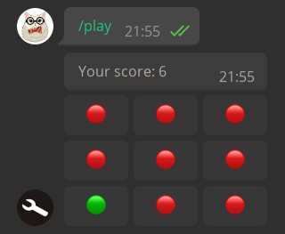

# aiogram-and-sqlalchemy-demo
   

A simple demo of using aiogram 3.x + async sqlalchemy 2.0+, made as a pop-it game where you need to click 
green circles and avoid red ones.

Used tech:
* [aiogram 3.x](https://github.com/aiogram/aiogram)
* [SQLAlchemy 2.0+](https://www.sqlalchemy.org/)
* PostgreSQL as database
* psycopg3 as database driver for SQLAlchemy
* Docker with docker-compose for deployment

Don't forget to create "postgres_data" (required) and "pgadmin_data" (if using PG Admin) directories 
before you run `docker-compose up -d`

Also copy `env_dist` file to `.env` and fill it with your data
